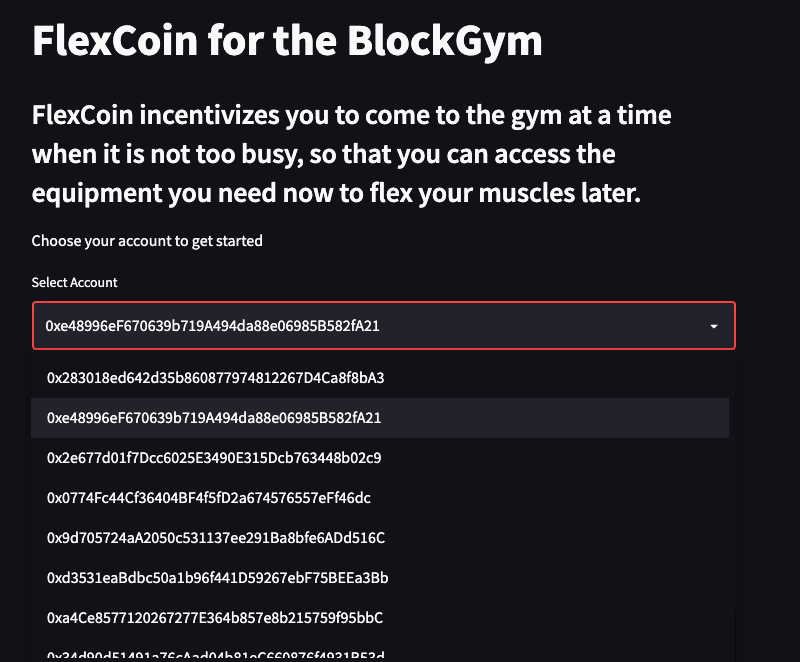
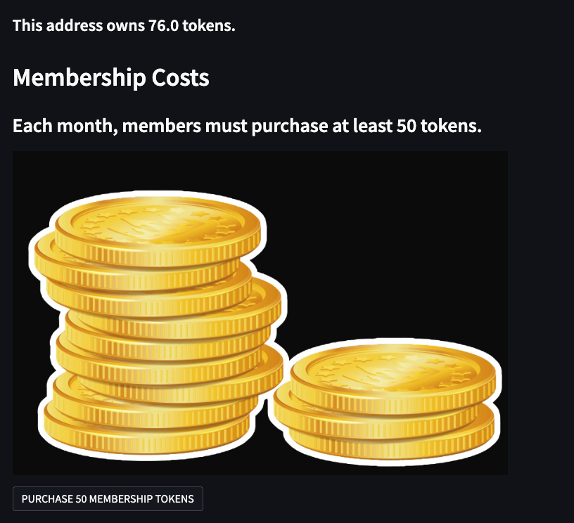
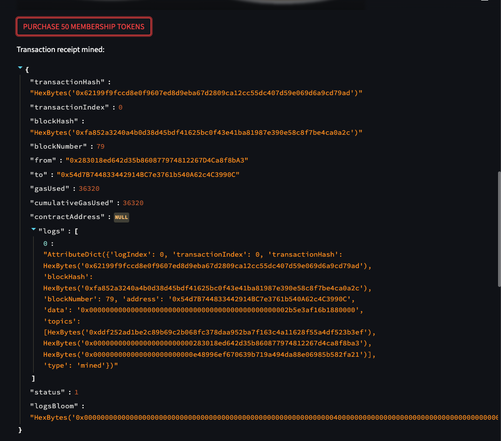
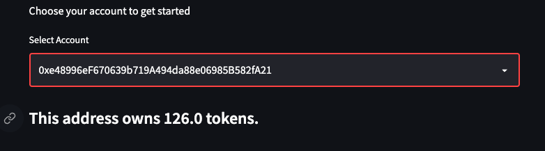
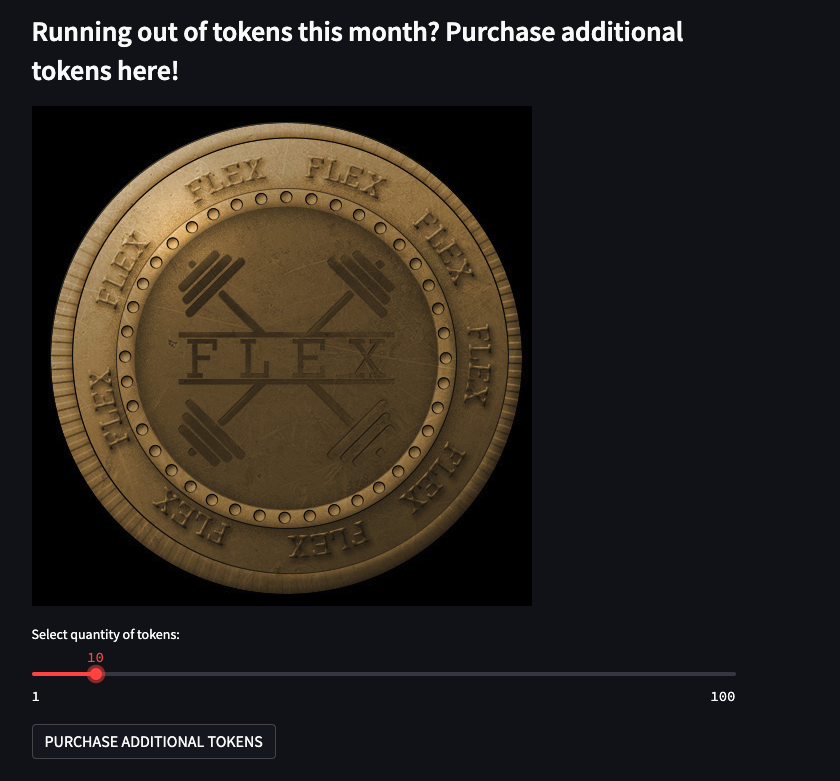
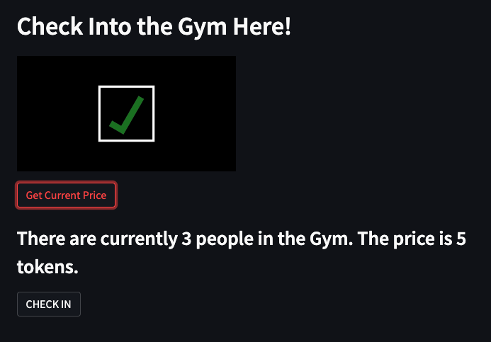
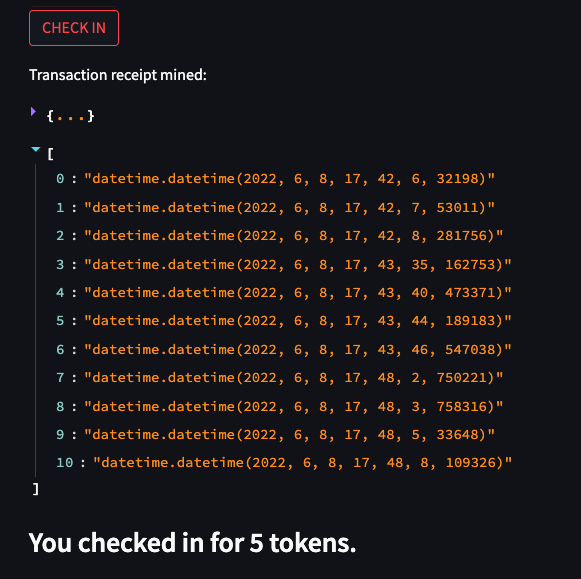
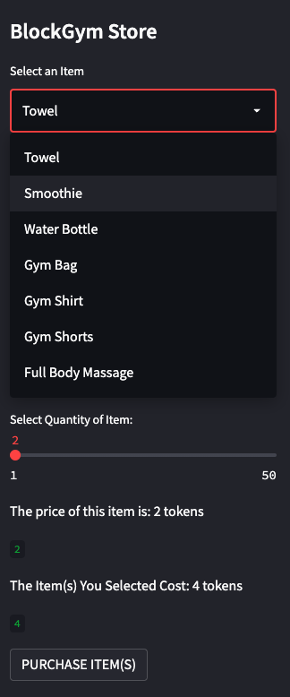

# FlexCoin for Gyms


## Project Description: 

Use tokenization to convert membership into the ownership of coins which will be spent to gain access, use premium amenities, purchase merchandise, and purchase other services of value. 

From a user's perspective, tokenization can also provide consumption data so that users can determine their own behavior and spending habits. 

For the purpose of this project, we will focus on using blockchain to determine the fluctuation of the cost per visit, based on how many users have spent tokens to access the gym at any point in time. 

---

## Technology:

This project leverages the following tools:
* [Solidity](https://docs.soliditylang.org/en/v0.8.13/) - programming language for implementing smart contracts
* [Remix IDE](https://remix.ethereum.org/#optimize=false&runs=200&evmVersion=null&version=soljson-v0.8.7+commit.e28d00a7.js) - open source tool that helps you write Solidity contracts straight from the browser; has modules for testing, debugging, and deploying of smart contracts
* [Ganache](https://trufflesuite.com/ganache/) - A program that allows you to quickly set up a local blockchain, which you can use to test and develop smart contracts
* [MetaMask](https://metamask.io/) - allows users to store and manage account keys, broadcast transactions, send and receive Ethereum-based cryptocurrencies and tokens, and securely connect to decentralized applications through a compatible web browser or the mobile app's built-in browser
* [Streamlit](https://streamlit.io/) - Turns data scripts into shareable web apps using Python
* [Web3.py](https://web3py.readthedocs.io/en/stable/overview.html) - A Python library for connecting to and performing operations on Ethereum-based blockchains

The Solidity version used for this project was the following:
`pragma solidity ^0.5.5`

Ganache network: w3 = Web3(Web3.HTTPProvider('HTTP://127.0.0.1:7545'))

OpenZeppelin libraries that were imported in the Remix solidity contract:

```
import "https://github.com/OpenZeppelin/openzeppelin-contracts/blob/release-v2.5.0/contracts/token/ERC20/ERC20.sol";
import "https://github.com/OpenZeppelin/openzeppelin-contracts/blob/release-v2.5.0/contracts/token/ERC20/ERC20Detailed.sol";
import "https://github.com/OpenZeppelin/openzeppelin-contracts/blob/release-v2.5.0/contracts/token/ERC20/ERC20Mintable.sol";
```
---

## Installation Guide:

If you do not already have the required **technologies** installed, install them now through your terminal.
For example:
```
pip install streamlit
pip install web3==5.17
```

If you do not already have MetaMask and Ganache installed, install them now: 
1. Download and install the MetaMask browser extension. Follow the [instructions here](https://metamask.io/download/) to install it.
2. Download and install the lastest version of Ganache. Follow the [instructions here](https://trufflesuite.com/ganache/) to install it. To create a workspace, click on "Quickstart Ethereum".

---

## Setup Guide 
1. Open [Remix IDE](https://remix.ethereum.org/#optimize=false&runs=200&evmVersion=null&version=soljson-v0.8.7+commit.e28d00a7.js) 
2. Open the smart contract file (`FlexCoin.sol`) in Remix IDE. (You may need to create a new file and copy and paste the Solidity code to the file)
3. While in the `FlexCoin.sol` file, select the "Solidity Compiler" tab and press the button that says, "Compile FlexCoin.sol"
4. Open **Ganache** and **Metamask**
5. Copy the Ganache RPC Server: HTTP://127.0.0.1:7545
6. Create and save a new network in MetaMask (for example, you can name it "devNetwork")
7. Open MetaMask and choose **Import Account**
8. Go to Ganache and copy a private key for the account
9. Go to MetaMask to paste the private key and import/create the account
10. There should be 100 ETH in the account, and the last 4 digits of the account in MetaMask should correspond to the last 4 digits of the account address in Ganache
11. Repeat steps 7-10 to create one more account so that you now have 2 accounts in MetaMask connected with two different addresses in Ganache
12. Select the "Deploy and Run Transactions" tab and choose the environment of **Injected Web3**. This should open MetaMask
13. Verify the connection to MetaMask and select the accounts that you want to be linked to the Remix contract and connect them 
14. Deploy the FlexCoin contract (remember to fill in the required boxes of 'name', 'symbol', and 'initial_supply' before deploying)
15. Copy the smart contract address of the deployed contract and paste it into the SAMPLE.env file next to 'SMART_CONTRACT_ADDRESS'
16. Copy the first account address from Ganache (i.e., owner account) and paste it into the SAMPLE.env file next to 'OWNER_ADD' 
17. Import FLEX token to the MetaMask accounts under the "Assets" tab
18. Use the functions in Remix IDE to mint coins to the owner and add minters 
19. Run the streamlit application by typing the following into your terminal:
` streamlit run gym_app.py`
20. Interact with the Streamlit drop down menus and buttons (See examples below)

---

## Usage and Implementation

Here is a quick preview of how the application works:


On the Streamlit app, you will first choose an account (10 accounts are loaded in from Ganache; the accounts need to be connected to MetaMask in order to work):


The app tells the user how many tokens they currently have and describes the monthly membership costs:


The user can use the "Purchase membership tokens" button to purchase the 50 membership tokens:


As a result, the token amount for the account increased by 50 tokens:


If a user needs more tokens, additional tokens can be purchased using the slider:


The user can click the "Get Current Price" button to see how many people are at the gym and how much it costs to enter based on the number of people at the gym:


The user clicks the "check in" button to check in for that price (5 tokens in this example):


There is also a Gym Store where users can purchase gym-related items:


In this example, the member uses the slider to purchase 3 water bottles at a cost of 9 tokens. The member clicks the "Purchase Item(s)" button, and the transaction receipt appears on the center of the app:


---

## Project Contributors

Kevin BaRoss

Rachel Bates

Michael Canavan

Catherine Croft

Vic Gellon

---

## License

MIT


